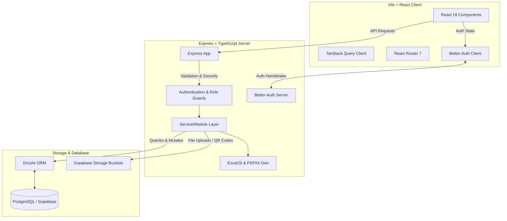

# 🌊 AssetFlow

> **An Enterprise-Grade Asset Management & Tracking System**

AssetFlow is a robust, modular, and modern web application designed to streamline the lifecycle management of organizational assets. From procurement and allocation to booking, maintenance schedules, and audit cycles, AssetFlow provides a central dashboard for complete transparency, efficiency, and compliance.

---

## 👥 Team Information
- **Team Name**: `code 01`
- **Members**:
  - 👤 **Abhijat Sinha**
  - 👤 **Garv Khatri**

---

## 🚀 Key Features

- **📊 Interactive Dashboard**: High-fidelity analytics, KPI tracking, and real-time visualization of asset statuses, maintenance due, and audit compliance using **Recharts**.
- **📦 Asset Lifecycle Directory**: Comprehensive directory supporting full CRUD operations, state transitions, QR code generation, and historical tracking.
- **🔗 Smart Allocations**: Assign assets to employees, departments, or branches, with detailed checkout/check-in logs and status reports.
- **📅 Conflict-Free Bookings**: Reservation system allowing team members to schedule and book assets for temporary usage.
- **🔧 Maintenance Scheduler**: Keep track of scheduled servicing, service records, maintenance history, cost tracking, and automatic status updates.
- **🛡️ Audit & Compliance Management**: Create audit tasks, verify physical assets, log audit outcomes, and track compliance metrics.
- **📄 Reporting & Analytics**: Export reports dynamically to **Excel (ExcelJS)** and **PDF (PDFKit)** with custom QR code embedding.
- **🔐 Enterprise Security & RBAC**: Fully-featured authentication (via **Better-Auth**) with strict Role-Based Access Control (`ADMIN`, `ASSET_MANAGER`, `DEPARTMENT_HEAD`, `EMPLOYEE`).
- **🔔 Activities & Notifications**: Real-time notifications and audit trails tracking every system mutation.

---

## 🏗️ Architecture Overview



---

## 💻 Tech Stack

### Frontend
- **Framework**: [React 19](https://react.dev/) with [Vite 8](https://vite.dev/)
- **State Management & Fetching**: [TanStack Query v5 (React Query)](https://tanstack.com/query/latest)
- **Routing**: [React Router v7](https://reactrouter.com/)
- **Forms & Validation**: [React Hook Form](https://react-hook-form.com/) & [Zod](https://zod.dev/)
- **Styling**: [Tailwind CSS v4](https://tailwindcss.com/)
- **UI Components**: [Radix UI Primitives](https://www.radix-ui.com/) (Dialog, Select, Tabs, Dropdown-Menu, etc.) & [Lucide Icons](https://lucide.dev/)
- **Charts**: [Recharts](https://recharts.org/)
- **Toasts**: [Sonner](https://sonner.emilkowal.ski/)
- **Table Controls**: [TanStack Table v8](https://tanstack.com/table/v8)

### Backend
- **Runtime & Language**: [TypeScript](https://www.typescriptlang.org/) + [Node.js](https://nodejs.org/)
- **Framework**: [Express.js v5](https://expressjs.com/)
- **Database Access**: [Drizzle ORM](https://orm.drizzle.team/)
- **Database**: [PostgreSQL](https://www.postgresql.org/) (hosted on [Supabase](https://supabase.com/))
- **Authentication**: [Better-Auth](https://www.better-auth.com/)
- **File Exporting**: [ExcelJS](https://github.com/exceljs/exceljs) & [PDFKit](https://pdfkit.org/)
- **Utilities**: `qrcode` (QR generation), `multer` (multipart uploads), `helmet` (HTTP headers security), `morgan` (logging)

---

## 📁 Repository Structure

```text
AssetFlow/
├── Backend/                 # TypeScript + Express.js API
│   ├── src/
│   │   ├── auth/            # Better-auth configuration & utilities
│   │   ├── config/          # Environment variables & constants
│   │   ├── db/              # Drizzle ORM config, schema definitions, migrations
│   │   ├── lib/             # Third-party service client initializations
│   │   ├── middleware/      # Auth, Role guards, error handlers
│   │   ├── modules/         # Modular feature folders (assets, maintenance, audits, etc.)
│   │   ├── routes/          # Express route registration
│   │   └── utils/           # Shared helper functions
│   ├── tsconfig.json
│   ├── drizzle.config.ts
│   └── package.json
│
├── Frontend/                # Vite + React Client
│   ├── src/
│   │   ├── components/      # Global reusable UI & guards (RoleGuard, ProtectedRoute)
│   │   ├── context/         # Auth contexts
│   │   ├── lib/             # API client & auth setup
│   │   ├── modules/         # Modular feature components, pages & hooks
│   │   ├── pages/           # General routes (Landing, Login, Signup, Error pages)
│   │   ├── routes/          # Application routing config
│   │   └── App.tsx
│   ├── index.html
│   ├── vite.config.ts
│   ├── tsconfig.json
│   └── package.json
│
└── README.md                # System documentation
```

---

## 🛠️ Getting Started

### Prerequisites
Make sure you have [Node.js (v18+)](https://nodejs.org/) and [NPM](https://www.npmjs.com/) installed. You will also need a running PostgreSQL database (e.g., Supabase instance) and Supabase Storage bucket.

---

### Backend Setup

1. **Navigate to the Backend directory**:
   ```bash
   cd Backend
   ```

2. **Install Dependencies**:
   ```bash
   npm install
   ```

3. **Configure Environment Variables**:
   Create a `.env` file in the root of the `Backend/` directory (you can copy `.env.example` as a template):
   ```bash
   cp .env.example .env
   ```
   Provide values for:
   - `PORT`: Port to run the server on (default: `3000`).
   - `DATABASE_URL`: Connection string to your PostgreSQL/Supabase database.
   - `BETTER_AUTH_SECRET`: A secure key for Better-Auth encryption.
   - `BETTER_AUTH_URL`: URL of the backend (e.g., `http://localhost:3000`).
   - `SUPABASE_URL`, `SUPABASE_SERVICE_ROLE_KEY`, `SUPABASE_STORAGE_BUCKET`: Supabase config for asset QR/attachment storage.

4. **Database Setup**:
   Generate SQL migrations and push them to your database using Drizzle Kit:
   ```bash
   # Generate migration SQL files
   npm run db:generate

   # Push schemas directly to DB (or run migrations)
   npm run db:push
   ```

5. **Start Dev Server**:
   ```bash
   npm run dev
   ```
   The backend will run on `http://localhost:3000` (or your configured `PORT`).

---

### Frontend Setup

1. **Navigate to the Frontend directory**:
   ```bash
   cd ../Frontend
   ```

2. **Install Dependencies**:
   ```bash
   npm install
   ```

3. **Start Development Server**:
   ```bash
   npm run dev
   ```
   The web portal will run on `http://localhost:5173`. Open it in your browser.

---

## 🛡️ Database Schema Overview

AssetFlow's relational schema is defined dynamically using Drizzle ORM, mapping:
- **`user` & `session`**: Managed by Better-Auth for authentication.
- **`organization`, `branch`, `department`**: Structural mapping of the organization hierarchy.
- **`asset`**: Holds detailed information, classification, cost, current status, location, and owner logs.
- **`allocation`**: Logs asset issuance, expected check-ins, actual check-ins, and handler status.
- **`booking`**: Handles advance room/equipment reservations with start/end times and approval flows.
- **`maintenance`**: Tracks maintenance dates, costs, tasks, and service technician details.
- **`audit`**: Creates compliance checkpoints, asset status confirmations, and notes.
- **`activityLog`**: Records automated trails of who, when, and what changed across the system.

---

## ⚡ Key Development Scripts

### Backend (`Backend/`)
- `npm run dev`: Launch hot-reloading server with `tsx`.
- `npm run build`: Compile TypeScript codebase to target Javascript.
- `npm run start`: Launch compiled production server.
- `npm run db:generate`: Generate migration files using Drizzle Kit.
- `npm run db:push`: Sync typescript schema directly with PostgreSQL database.
- `npm run db:studio`: Launch graphical DB manager via Drizzle Studio.

### Frontend (`Frontend/`)
- `npm run dev`: Spin up local Vite development server.
- `npm run build`: Lint code and compile production assets.
- `npm run lint`: Run ESLint analysis.
- `npm run preview`: Run local server to preview the built distribution.
